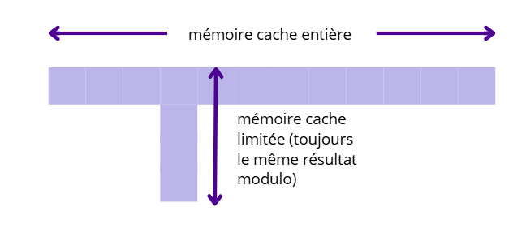
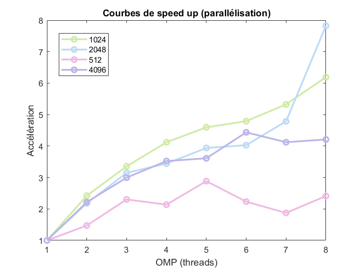

# Compte-rendu TD1
### Elfie Molina--Bonnefoy

##  1 - Données de l'ordinateur sur lequel le TP a été lancé

Les résultats obtenus dans ce TD étant propre à chaque machine, les caractéristiques utiles de l'ordinateur sont données ci-dessous (commande lscpu) :
```
Architecture:             x86_64
  CPU op-mode(s):         32-bit, 64-bit
  Address sizes:          39 bits physical, 48 bits virtual
  Byte Order:             Little Endian
CPU(s):                   8
  On-line CPU(s) list:    0-7
Vendor ID:                GenuineIntel
  Model name:             11th Gen Intel(R) Core(TM) i7-1165G7 @ 2.80GHz
    CPU family:           6
    Model:                140
    Thread(s) per core:   2
    Core(s) per socket:   4
    Socket(s):            1
    
Caches (sum of all):
  L1d:                    192 KiB (4 instances)
  L1i:                    128 KiB (4 instances)
  L2:                     5 MiB (4 instances)
  L3:                     12 MiB (1 instance)
```
Sur cet ordinateur, on peut donc repérer que l'ordinateur possède 4 cœurs physiques et la possibilité d'avoir une parallélisation sur 8 CPU virtuels. 

Cet ordinateur possède aussi une fréquence théorique de calcul de 2.80GHz.

## 2 - Optimisation du produit matrice-matrice

L'exercice suivant propose différentes solutions de prise d'optimisation du temps de calcul nécessaire pour une multiplication matricielle. Pour connaître le temps de calcul, un chrono est lancé juste avant le début du calcul matriciel (qui est ici la partie la plus chronophage du programme) et arrêté ensuite :
```
start = std::chrono::system_clock::now();
Matrix C = A * B;
end = std::chrono::system_clock::now();
```

La compilation permet aussi d'obtenir le nombre d'opération `(+,x)` en virgule flottante par seconde (unité FLOPS).

Ces deux critères - le temps de calcul et le FLOPS - sont ceux utilisées pour valider nos hypothèses d'optimisation du calcul matriciel durant tout le long de ce TD.

### Effet de la taille de la matrice

Compilation faite avec : 
`make TestProductMatrix.exe && ./TestProductMatrix.exe 1024`

  n            |  MFlops | temps (s)
:--------------|:-------:|:---------:
1023           | 491.683 | 4.35484 
1023           | 584.144 | 3.66553 
1023           | 517.558 | 4.13712 
moyenne (1023) | **531.128** | **4.05249** 
1024           | 596.796 | 3.61653 
1024           | 344.209 | 6.23889 
1024           | 468.483 | 4.5839  
moyenne (1024) | **469.829** | **4.8131** 
1025           | 529.102 | 4.07064 
1025           | 556.818 | 3.86802 
1025           | 482.543 | 4.4634  
moyenne (1025) | **522.821** | **4.13402** 

Les temps obtenus ne peuvent pas être étudié en l'état. Sur les autres ordinateurs, le temps mis pour une taille 1024 est environ *six à sept fois supérieur* au temps mis pour les tailles 1023 ou 1025. 

Cet écart s'explique en prenant en compte la structure du cache. Le cache peut se représenter par une ligne de zones mémoires où les données contiguës sont stockées temporairement depuis la mémoire RAM en utilisant un modulo de l'adresse RAM. Si deux adresses RAM obtiennent le même modulo, elles peuvent être stockée sur la même zone cache mais il y aura moins de place. 

Ici, lorsque les coefficients des matrices sont chargés sur le cache, avec une taille 1023 ou 1025, elles ont la possibilité de prendre tout l'espace de stockage cache et donc l'accès aux données contiguës lors des calculs des produits un à un se fait rapidement. Mais, lorsque la taille est de 1024, le modulo de l'adresse mémoire RAM d'un coefficient sera presque toujours équivalent à celui d'un autre et dans ce cas les données caches ne sont conservés que sur une taille réduite de mémoire cache ce qui ralentit les calculs puisqu'il faut accéder à la mémoire RAM plus souvent.

### Effet des permutations des boucles

Compilation avec :
`make TestProductMatrix.exe && ./TestProductMatrix.exe 1024`. 
Le calcul matriciel proposé dans ce TD est un calcul coefficient par coefficient comme dans la formule $C_{i,j} = C_{i,j} + A_{i, k} \times B_{k, j}$ et ce dans une triple boucle sur les coordonnées i,j et k. L'intérêt de ce calcul est de trouver la combinaison des boucles optimales pour réduire le temps de calcul.

  ordre |time (1024)|  MFlops (1024)  | time (2048) | MFlops(2048)
--------|:---------:|:---------------:|:-----------:|:------------:
 i,j,k  |  3.47573  |     617.851     |   83.9308   |   204.691 
 j,i,k  |  5.78662  |     371.112     |   97.9336   |   175.424 
 i,k,j  |  10.4854  |     204.808     |   282.588   |   60.7947
 k,i,j  |  8.66409  |     247.86      |   187.755   |   89.6377 
**j,k,i**|**0.91138**|   **2356.29**   | **8.68244** | **1978.69** 
 k,j,i  |  1.13183  |     1897.36     |   8.97278   |   1914.67 

En regardant la manière dont sont gardées en mémoire les matrices, on remarque qu'elles sont stockées en colonnes (`return m_arr_coefs[i+j*nbRows]`) c'est-à-dire que les coefficients lus colonne par colonne sont stockées de manière contiguës. Ainsi - comme, lorsque l'on accède à une donnée de la mémoire RAM, les valeurs contiguës sont chargées dans le cache - il faut avoir un algorithme qui permet d'exploiter cette fonctionnalités pour obtenir un temps optimal.

 Le meilleur algorithme est donc celui qui parcourt d'abord les matrices A et C en colonnes (mémoire contiguë) tout en gardant une valeur constante pour le coefficient de la matrice B lors de la boucle interne. On devrait ainsi effectuer le produit en parcourant la boucle i en dernier (boucle interne). Cela entre en cohérence avec les temps et les FLOPS obtenus par les combinaisons optimales j-k-i et k-j-i qui sont nettement inférieurs en temps et supérieurs en FLOPS aux autres avec un facteur 10. 

 Pour le reste du TD, les calculs s'effectuent avec la combinaison de boucle j-k-i suivante : 

 ```
  for (int j = iColBlkB; j < std::min(B.nbCols, iColBlkB + szBlock); j++)
    for (int k = iColBlkA; k < std::min(A.nbCols, iColBlkA + szBlock); k++)
      for (int i = iRowBlkA; i < std::min(A.nbRows, iRowBlkA + szBlock); ++i)
        C(i, j) += A(i, k) * B(k, j);
```

### Parallélisation à l'aide d'OpenMP 

Compilation avec :
`make TestProductMatrix.exe && OMP_NUM_THREADS=3 ./TestProductMatrix.exe 1024` et le paramètre `#pragma omp parallel for` au début des trois boucles lors du calcul du produit matriciel. L'outil OpenMP permet d'utiliser plusieurs threads en parallèle pour effectuer les calculs (dans la limite de la disponibilité de l'ordinateur).

 threads | MFlops (1024) | MFlops (2048) | MFlops (512) | MFlops (4096)
:-------:|:-------------:|:------------:|:-----------:|:------------:
1        |    1932.22    |   1906.49    |   2821.96   | 1949.97
2        |    4677.90    |   4153.65    |   4153.58   | 4322.69
3        |    6348.47    |   6001.40    |   6499.18   | 5840.29
4        |    7960.68    |   6562.11    |   6029.56   | 6868.68
5        |    8878.83    |   7509.03    |   8137.43   | 7040.07
6        |    9257.75    |   7679.83    |   6297.50   | 8648.43
7        |    10288.1    |   9123.57    |   5286.16   | 8036.98
8        |    11960.2    |   14919.5    |   6801.46   | 8207.72

Comme attendu, les performances - nombre d'opération par seconde - augmentent avec le nombre de threads mis en jeu. La parallélisation du problème permet ainsi de calculer plusieurs coefficients en simultanée et donc de réduire le temps de calcul et d'améliorer les performances.



Il est aussi possible de calculer l'accélération (speed up) des performances grâce au temps de calcul : $S_p$ = $\frac{T_s}{T_p}$. Les valeurs de ces accélération sont données dans le tableau ci-dessous :

threads | Sp (1024) | Sp (2048) | Sp (512) | Sp (4096)
:------:|:---------:|:---------:|:--------:|:---------:
1       |     1     |     1     |     1    |    1
2       |  2.4210   |  2.1783   |  1.4719  | 2.2168
3       |  3.3560   |  3.1479   |  2.3031  | 2.9951
4       |  4.1200   |  3.4420   |  2.1367  | 3.5225
5       |  4.5951   |  3.9387   |  2.8836  | 3.6104
6       |  4.7913   |  4.0283   |  2.2316  | 4.4352
7       |  5.3245   |  4.7855   |  1.8732  | 4.1216
8       |  6.1899   |  7.8256   |  2.4102  | 4.2092

La parallélisation sur plusieurs threads permet d'améliorer les performances de manière flagrante. On repère toutefois des accélérations stable même après ajout d'un thread supplémentaire.

Le résultat obtenu est donc sûrement améliorable puisque les différents threads accèdent à la même mémoire cache et empiètent donc les uns sur les autres dans leurs calculs. Pour améliorer le résultat, il faudrait jouer sur la taille des données dans la mémoire cache pour éviter au maximum que deux threads se ralentissent en prenant l'accès à la mémoire cache.


### Effet du produit par blocs

Compilation avec :
`make TestProductMatrix.exe && ./TestProductMatrix.exe 1024`. Le produit matriciel est effectué en parcourant les matrices par bloc d'une taille variable. Dans cette partie, on cherche à optimiser le temps de calcul en ajustant la taille de ce bloc (`szBlock`).

  szBlock | MFlops (1024) | MFlops(2048) | MFlops(512) | MFlops(4096)
----------|:-------------:|:------------:|:-----------:|:----------:
32        |    2352.62    |   2306.16    |   2708.73   |   2129.95
64        |    2317.85    |   2344.76    |   2540.59   |   2175.03
128       |    2635.17    |   1852.95    |   2381.34   |   2227.52
256       |    2489.64    |   2269.74    |   3033.9    |   2199.03
512       |    2924.42    |   2257.14    |   2511.54   |   2272.14
1024      |    2568.36    |   1877.93    |   3094.48   |   2203.37

Cette méthode consiste à charger les coefficients de la matrice dans un bloc de taille inférieur à celle de la RAM. La boucle sur ces blocs permet d'optimiser l'utilisation des tailles des caches. On remarque cependant que cette méthode ne semble pas très performante sur l'ordinateur utilisé.

De même, si on compare le temps du calcul par rapport au produit matrice–matrice ”scalaire”, on s'aperçoit qu'il n'y a presque aucune amélioration visible :

szBlock       |time (1024)|time (2048)| time (512)| time (4096)
--------------|:---------:|:---------:|:---------:|:----------:
32            |  0.912803 |  7.44954  | 0.0991002 | 64.5268
64            |  0.926497 |  7.32691  | 0.105659  | 63.1893 
128           |  0.814931 |  9.27163  | 0.112724  | 61.7005
256           |  0.862568 |  7.56909  | 0.0884786 | 62.4997
512           |  0.734327 |  7.61136  | 0.106881  | 60.4888
1024          |  0.83613  |  9.14831  | 0.0867466 | 62.3768    

La faible amélioration des performances grâce au produit par bloc peut être dû à une saturation de la bande passante mémoire peu présente.

### Effet du produit par blocs et de l'outil OpenMP

szBlock| threads | MFlops (1024)  | MFlops (2048) | MFlops(512)  | MFlops(4096)|
-------|:-------:|:--------------:|:-------------:|:------------:|:-----------:|
1024   |    1    |     3354.69    |    3009.33    |   3689.13    |   3023.38   |
1024   |    8    |     12821.8    |    11122      |   13129.1    |   9711.52   |
512    |    1    |     3315.52    |    2917.19    |   3807.30    |   3056.31   |
512    |    8    |     13107.6    |    11284.5    |   12147.9    |   10511.1   |

La combinaison des deux méthodes donnent des résultats intéressants, il est clair que la parallélisation a un rôle majeur dans l'évolution des performances mais la taille du bloc pourrait être optimisée au vue des légères différences d'efficacité entre la taille 1024 et 512.

La taille du bloc optimale - qui n'est pas bien observé ici - serait celle qui permettrait d'optimiser la parallélisation des threads. Il faut une taille de bloc qui permettre d'avoir suffisamment de blocs pour pouvoir les paralléliser sur les 8 threads disponibles.

### Comparaison avec BLAS et MKL

En utilisant le code fourni dans les sources et la bibliothèque BLAS ou MKL, voici les résultats finaux :

  bibliothèque | threads | MFlops (1024) | MFlops (2048) | MFlops (512)  | MFlops (4096)|
---------------|:-------:|:-------------:|:-------------:|:-------------:|:------------:|
BLAS           |    1    |    3034.17    |    2424.29    |    3180.95    |    2426.47   |
MKL            |    1    |    18706.9    |    38676.2    |    7787.94    |    41082.6   |
MKL            |    4    |     40563     |    104581     |    8782.55    |    119004

Les performances obtenues pour la bibliothèque BLAS ne pouvant être étudiées en l'état, la bibliothèque MKL (de Intel) a été utilisé avec de meilleurs résultats.

Avec la bibliothèque MKL, on repère un *facteur 5 voire 10* entre les résultats rendus par l'optimisation manuelle (**ex** : $10511.1$ MFLOPS pour $n=4096$ et $OMP=8$) et l'utilisation de la bibliothèque (**ex** : $119004$ MFLOPS pour $n=4096$ et $OMP=8$) avec plusieurs OMP. Cet écart de performance montre que l'utilisation de bibliothèques spécialisée reste plus efficace qu'une optimisation manuelle et qu'il faudrait d'abord chercher s'il n'existe pas d'algorithme déjà connu avant de se lancer dans l'optimisation d'un calcul pour être le plus efficace possible.

## 2 - Parallélisation à l'aide de MPI

### Circulation d'un jeton dans un anneau

Le principe de cet algorithme est de distribuer la mémoire entre des contextes parallèles. Le process de rang zéro se verra attribuer la charge d'envoyer le premier token et de recevoir le dernier token une fois qu'il sera passer par tous les process. Le programme est retranscrit ici (`token_2_1.py`) :

``` python
import numpy as np
from mpi4py import MPI

globCom = MPI.COMM_WORLD.Dup()
nbp     = globCom.size
rank    = globCom.rank
name    = MPI.Get_processor_name()

if(rank==0):
    token = 1
    globCom.send(token, dest = 1)
    token = globCom.recv(source = nbp-1)
    print(f"token received by {nbp-1} is {token} (message from {rank})")
elif(rank > 0 and rank < nbp-1):
    token = globCom.recv(source = rank-1) + 1
    globCom.send(token, dest = rank+1)
else:
    token = globCom.recv(source = nbp-1-1) + 1
    globCom.send(token, dest = 0)
    
```

### Calcul très approché de $\pi$

Ce programme se propose de calculer une valeur approchée de $\pi$ et de comparer le temps mis avec et sans parallélisation MPI. Le principe est d'envoyer des points aléatoirement dans un carré de côté 1 et de calculer s'ils sont de norme inférieure ou égale à 1. Le total des points dans présent dans le cercle unité (et donc de norme inférieure ou égale à 1) est noté r et sert au calcul de $\pi$ : $\pi$ = $4 \times r$.


Les codes utilisés pour la parallélisation MPI avec python sont donnés dans les fichiers `pi_2_2.py` et `pi_2_2_mpi.py` et ont été compilé avec `mpiexec -n i python3 pi_2_2_mpi.py`. Pour un total de 10000000 points aléatoirement lancés dans le carré de côté 1, on obtient les résultats suivant :

$\pi$ (approximation) | tâche | time
:--------------------:|:-----:|:---:
3.1400504             |   1   | 8.204468
3.1406228             |   2   | 4.447845
3.1416864             |   3   | 3.454277
3.1416700             |   4   | 2.903936

La performance de la parallélisation MPI est bien visible avec une diminution des temps de calcul par deux à quatre fois en fonction du nombre de threads disponible. L'accélération maximale est d'environ 2,83.

Le code utilisé pour la parallélisation MPI avec C est donné dans le fichier `pi_2_2_mpi.cpp` et a été compilé avec `mpic++ pi_2_2_mpi.cpp && mpiexec -n i ./a.out`. Pour un total de 10000000 points aléatoirement lancés dans le carré de côté 1, on obtient les résultats suivant :

$\pi$ (approximation) | tâche | time
:--------------------:|:-----:|:---:
3.14269               |   1   | 3.25751102
3.13886               |   2   | 1.44704186
3.14116               |   3   | 1.05238581
3.14236               |   4   | 0.77674623

La performance de la parallélisation MPI est bien visible avec une diminution des temps de calcul par deux à trois fois en fonction du nombre de threads disponible. L'accélération maximale est d'environ 4,19.

### Diffusion d'un entier dans un réseau hypercube

Le principe de ce programme est d'envoyer un même jeton à tous les membres d'un hypercube de dimension d en un nombre d'étapes minimal (égal à la dimension de l'hypercube d). Au total, il y a $2^d$ nœuds de calculs dans le réseau.

L'idée serait donc d'envoyer d'abord le jeton à un autre nœud, puis que ces deux nœuds l'envoient à deux autres jusqu'à arriver à la totalité des nœuds du réseau. Pour se faire il faut suivre l’algorithme suivant :

* **Initialisation** : la tâche de rang 0 demande un entier à l'utilisateur envoi ce jeton à la tâche de rang 1
* **Tant que i est inférieur à d** :
  * Les jetons de rang inférieur ou égal à $2^i$ reçoivent un jeton de la part du rang **rang - $2^{(i-1)}$**
  * Les jetons ayant reçu un jeton le renvoi au jeton en position **rang + $2^i$**

En suivant cet algorithme, en d étapes, les $2^d$ nœuds du réseaux obtiennent le jeton et sont capables de l'afficher en simultané. Cela demandant d'avoir $2^d$ threads à disposition, le programme a été testé en se connectant au service `@salle.ensta.fr` dont les caractéristiques sont présentées ci-dessous :
```
Architecture :                          x86_64
  Mode(s) opératoire(s) des processeurs : 32-bit, 64-bit
  Boutisme :                              Little Endian
Processeur(s) :                         32
  Liste de processeur(s) en ligne :       0-31
  Thread(s) par cœur :                    2
  Cœur(s) par socket :                    8
  Socket(s) :                             2
  Nœud(s) NUMA :                          2
Virtualisation :                        VT-x
  Cache L1d :                             32K
  Cache L1i :                             32K
  Cache L2 :                              256K
  Cache L3 :                              20480K
```
Les temps mis pour passer le token entre tous les nœuds du réseau sont transcrits dans le tableau suivant (pour des dimensions de 0 à 7) :

dimension | MPI | time
:--------:|:---:|:--------:
  0       |  1  | 1.404354
  1       |  2  | 1.367691 
  2       |  4  | 1.282819
  3       |  8  | 1.390689
  4       | 16  | 1.420558
  5       | 32  | 1.133046
  6       | 64  | 0.607283
  7       | 128 | 0.857599

Le code est présent dans le fichier `hypercube_2_3.py`.