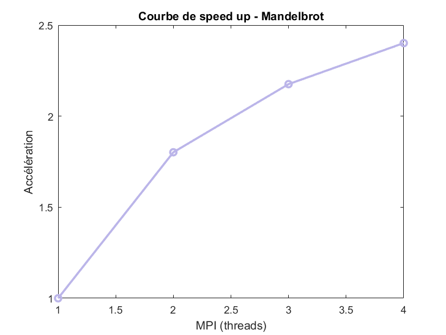
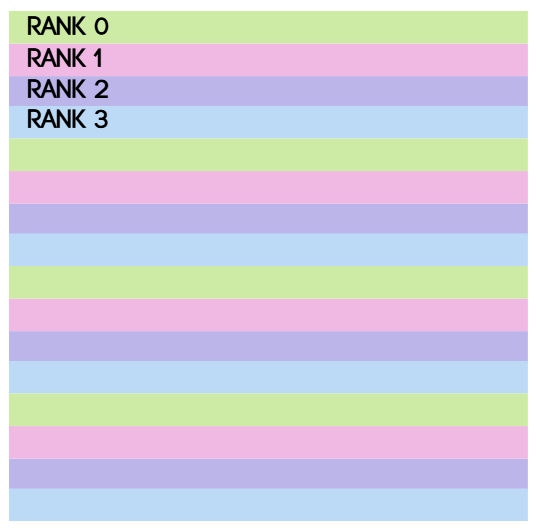
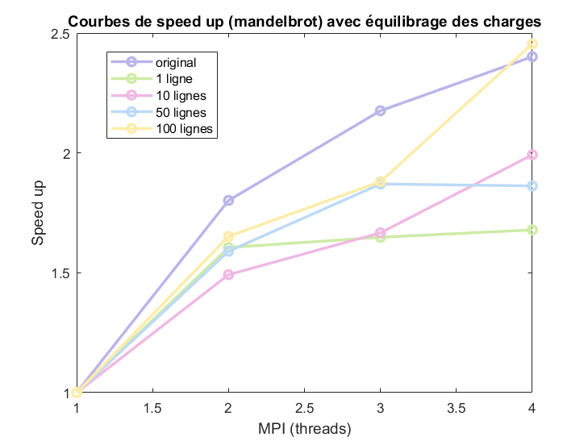
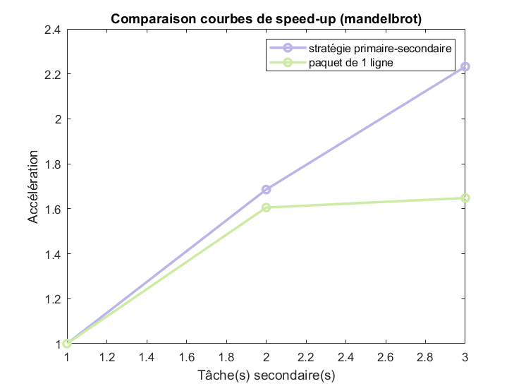
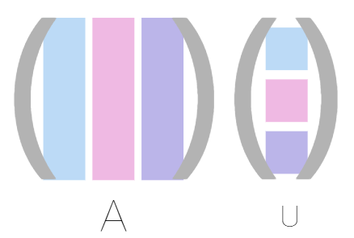
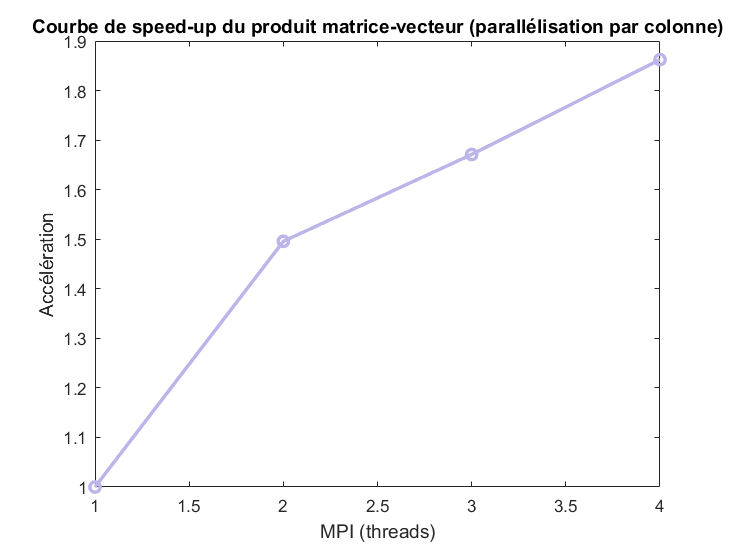
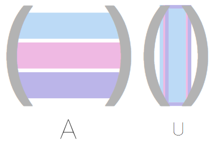
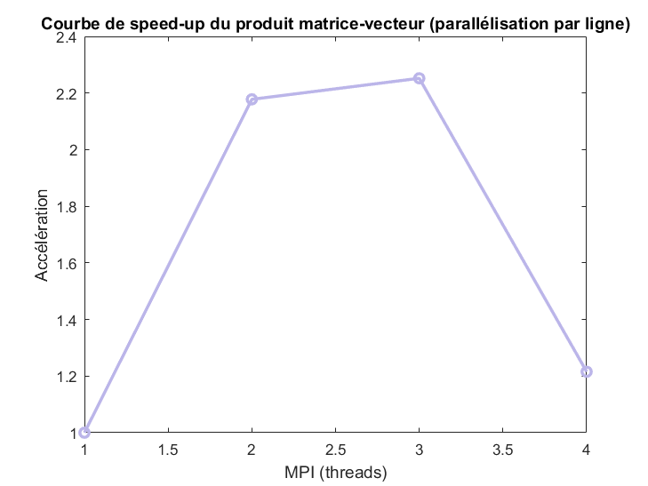

# Compte-rendu TD1
### Elfie Molina--Bonnefoy

##  1 - Données de l'ordinateur sur lequel le TP a été lancé

Les résultats obtenus dans ce TD étant propre à chaque machine, les caractéristiques utiles de l'ordinateur sont données ci-dessous (commande lscpu) :
```
Architecture:             x86_64
  CPU op-mode(s):         32-bit, 64-bit
  Address sizes:          39 bits physical, 48 bits virtual
  Byte Order:             Little Endian
CPU(s):                   8
  On-line CPU(s) list:    0-7
Vendor ID:                GenuineIntel
  Model name:             11th Gen Intel(R) Core(TM) i7-1165G7 @ 2.80GHz
    CPU family:           6
    Model:                140
    Thread(s) per core:   2
    Core(s) per socket:   4
    Socket(s):            1
    
Caches (sum of all):
  L1d:                    192 KiB (4 instances)
  L1i:                    128 KiB (4 instances)
  L2:                     5 MiB (4 instances)
  L3:                     12 MiB (1 instance)
```
Sur cet ordinateur, on peut donc repérer que l'ordinateur possède 4 cœurs physiques et la possibilité d'avoir une parallélisation sur 8 CPU virtuels. 

Cet ordinateur possède aussi une fréquence théorique de calcul de 2.80GHz.

## 2 - Parallélisation de l'ensemble de Mandelbrot

L'ensemble de Mandelbrot est un ensemble fractal définie par la convergence ou la divergence des éléments de la suite récursive suivante :
$$
\left\{
\begin{array}{l}
    c\,\,\textrm{valeurs\,\,complexe\,\,donnée}\\
    z_{0} = 0 \\
    z_{n+1} = z_{n}^{2} + c
\end{array}
\right.
$$
dépendant du paramètre $c$.

Cet exercice se propose d'essayer de paralléliser le calcul de l'ensemble de Mandelbrot et la création d'une image de taille `1024 par 1024` qui représente la fractale obtenue à partir des divergences ou convergences de la suite. Cette fractale ressemble à :


Pour paralléliser ce calcul, trois méthodes sont envisagées et comparées dans la suite de l'exercice.

### A - Répartition équitable
La première méthode consiste à créer une répartition équitable de l'image par bloc suivant les lignes puis de rassembler l'image sur le processus zéro pour la sauvegarder. Les `nbp` processus ont un rôle similaire et seul le processus de rang zéro reçoit les blocs d'images des autres rangs pour reconstituer la fractale complète.


Le programme utilisé est donné dans le code `mandelbrot_1.py` sans utiliser les fonctions `scatter` et `gather` qui auraient pu améliorer les performances. Les temps de constitution de l'image et de calcul de l'ensemble de Mandelbrot sont reportés dans le tableau ci-dessous : 

tâches |    temps (image)   | temps (calcul)
:-----:|:------------------:|:---------------:
   1   | 3.9225001335144043 | 4.0267698764801025
   2   | 2.3381519317626953 | 2.4319517612457275
   3   | 2.0124073028564453 | 2.103884696960449
   4   | 1.8232042789459229 | 1.9337542057037354

On remarque une nette amélioration des performances entre le programme séquentiel et le programme parallélisé. Cependant, l'accélération des performances entre les différents degrés de parallélisations est assez faible : le speed-up est aux alentours de 2 pour le nombre de processus testé. Cela pourrait s'expliquer par le fait que la taille des charges (`height//nbp`) est trop grande ce qui entraîne un mauvais équilibrage des charges et une possible lenteur dans les calculs avec plusieurs tâches.



### B - Répartition par tranches de n lignes
Pour pallier au problème d'une possible taille de charges trop grande, il serait possible de faire en sorte que chaque processus travaille sur un ensemble de n lignes. Les processus travaillent donc par paquets de n lignes et l'envoient au processus zéro après leur calcul pour que celui reconstruise l'image. Le programme utilisé est donné dans le code `mandelbrot_2.py`. Un exemple de répartition est présenté dans la figure ci-dessous :



Pour que cette méthode soit efficiente, il faut faire attention à garder une granularité trop fine. Si la granularité est trop fine (par exemple si l'on teste ligne par ligne), la quantité d'échanges entre les processus sera trop grande et ralentira le calcul. Il faut donc avoir un n optimal pour observer une amélioration des performances.

Dans le tableau ci-dessous, les temps de constitution de l'image et du calcul de l'ensemble de Mandelbrot sont donnés pour des paquets de 10 lignes ($n=10$) :

tâches |    temps (image)   |   temps (calcul)
:-----:|:------------------:|:---------------:
   1   | 3.6406078338623047 | 3.727651834487915
   2   | 2.3995401859283447 | 2.498302936553955
   3   | 2.147181510925293  | 2.2367191314697266
   4   | 1.7653186321258545 | 1.8711907863616943

 Les courbes de speed-up ont été calculés pour des valeurs de $n~\in ~\{1,10,50,100\}$ et sont comparés avec la courbe originale obtenue dans la partie A. 



On remarque comme pensé précédemment, que pour des paquets trop petits (1 ou 10 ligne(s)), l'accélération est quasi-statique en fonction du nombre de tâches utilisés. 

### C - Stratégie maître-esclave (primaire-secondaire)
Dans cette méthode, l'objectif est d'isoler un processus (arbitrairement le processus de rang 0) pour le désigner comme primaire. Ce processus ne fera plus aucun calcul de l'ensemble de Mandelbrot et ne servira plus qu'à - en plus de recevoir et de construire l'image finale complète - envoyer les lignes à calculer aux autres tâches. Le programme utilisé est donné dans le code `mandelbrot_3.py`.

Dans le tableau ci-dessous, les temps de constitution de l'image et du calcul de l'ensemble de Mandelbrot sont donnés pour des paquets de 10 lignes ($n=10$) :

tâches |    temps (image)   |   temps (calcul)
:-----:|:------------------:|:---------------:
   2   | 0.0382268428802490 | 4.280805349349976
   3   | 0.0411314964294433 | 2.5399415493011475
   4   | 0.0438287258148193 | 1.9175279140472412

Les courbes de speed-up ont été calculés à la suite. Il faut tout de même retenir, pour les comparaisons, que lors de cette stratégie, le nombre de tâche travaillant réellement est de `nbp-1`.



La stratégie primaire-secondaire semble donc être meilleure pour un nombre de tâche grandissant - il a été impossible de tester sur plus de tâches. Cela est sûrement dû au fait qu'il y ait une meilleure répartition des tâches lors de cette stratégie (les tâches terminent toutes en même temps) et non plus une tâche 0 qui prenait un temps plus long à calculer son ensemble et traiter les données des autres processus. 


## 3 - Produit matrice-vecteur

L'objectif de cet exercice est de paralléliser un produit matrice-vecteur en suivant deux méthodes : découper la matrice par colonne ou par ligne. Pour la suite de l'exercice, on notera $A$ la matrice carrée de taille $N$, $u$ le vecteur colonne et $v$ le vecteur résultat du produit.

### A. Produit parallèle matrice-vecteur par colonne
Lorsque la matrice est découpée par colonne, chaque tâche possède $N_{loc} = N/nbp$ colonnes et $N$ lignes de la matrice et n'a besoin que de $N/nbp$ coordonnées du vecteur. La manière de distribuer les données est représentée sur ce dessin et expliquer dans les étapes suivantes :



* Pour que chaque tâche ne reçoivent que la quantité d'information utile, on utilise la fonction `Scatter` qui découpe la matrice $A$ et le vecteur $u$ en `nbp` parts égales et les envoies séparément à chaque tâches.

* La tâche $i$ possède donc une partie de la matrice $A_i$ et une partie du vecteur $u_i$. Avec ces deux fragments, elle peut calculer une partie du vecteur produit : $v_i = A_i \times u_i$. Le vecteur v est alors retrouvé en sommant les $v_i$.

* Ainsi, pour qu'à la fin du programme chaque tâche possède le vecteur produit complet, on utilise la fonction `Allreduce(MPI.SUM)` qui renvoi à tous les processus la somme des $v_i$.

Cet algorithme a été codé dans le programme `matvec.py` lorsque la variable méthode est mise à `colonne`. Les temps de calcul du produit matrice-vecteur sont données dans le tableau ci-dessous :

tâches |      temps (ms)
:-----:|:--------------------:
   1   | 5.049943923950195
   2   | 3.3762454986572266
   3   | 3.0221939086914062
   4   | 2.7115345001220703

La courbe de speed-up peut ainsi être calculée et tracée :



### B. Produit parallèle matrice-vecteur par ligne
Lorsque la matrice est découpée par ligne, chaque tâche possède $N$ colonnes et $N_{loc} = N/nbp$ lignes de la matrice mais a besoin de l'entièreté du vecteur $u$. La manière de distribuer les données est représentée sur ce dessin et expliquer dans les étapes suivantes :



* Pour que chaque tâche ne reçoivent que la quantité d'information utile, on utilise la fonction `Scatter` qui découpe la matrice $A$ en `nbp` parts égales et les envoies séparément à chaque tâches. Le vecteur $u$ est quant à lui envoyer en entier à tous les processus et ce via la fonction `Bcast` (broadcast) de python.

* La tâche $i$ possède donc une partie de la matrice $A_i$ et l'ensemble du vecteur $u$. Avec ces deux vecteurs, elle peut calculer une partie du vecteur produit : $v_i = A_i \times u$. Le vecteur v est alors retrouvé en concaténant les $v_i$ : $v~=~\begin{pmatrix}
v_1 \\
v_2 \\
v_3
\end{pmatrix}$.

 * Ainsi, pour qu'à la fin du programme chaque tâche possède le vecteur produit complet, on utilise la fonction `Allgather` qui renvoi à tous les processus la concaténation des $v_i$.

Cet algorithme a été codé dans le programme `matvec.py` lorsque la variable méthode est mise à `ligne`. Les temps de calcul du produit matrice-vecteur sont données dans le tableau ci-dessous :

tâches |      temps (ms)
:-----:|:--------------------:
   1   | 5.759239196777344
   2   | 2.6445388793945312
   3   | 2.5572776794433594
   4   | 4.738330841064453

La courbe de speed-up peut ainsi être calculée et tracée :



Si cette méthode semble plus performante pour une parallélisation à 2 ou 3 tâches, elle s'écroule dès qu'on utilise 4 tâches (même après plusieurs vérifications). Le choix d'une parallélisation par colonne ou par ligne pourrait donc être liés au nombre de processus utilisés.

## 3 - Entraînement pour l'examen écrit

1. En utilisant la loi d’Amdhal, pouvez-vous prédire l’accélération maximale que pourra obtenir Alice avec son code (en considérant n ≫ 1) ?

La loi d'Amdahl définie l'accélération pour une parallélisation sur n cœurs comme étant :

$S_p = \frac{t_s}{(f.t_s) + \frac{(1-f)t_s}{n}} = \frac{n}{1 + (n-1)f}$

En considérant de plus, $n \gg 1$, on obtient la simplification suivante : $S_p \simeq \frac{1}{f}$.

Dans cette expression, $f$ représente la fraction du programme qui ne peut pas être parallélisé. Ici, seul $90\%$ du programme est parallélisé lors de l'exécution donc $f = 10\% = 0.1$.

On peut donc espérer une accélération maximale de :
$S_p = \frac{1}{f} = 10$

2. À votre avis, pour ce jeu de donné spécifique, quel nombre de nœuds de calcul semble-t-il raisonnable de prendre pour ne pas trop gaspiller de ressources CPU ?

Grâce à la loi d'Amdahl, il est possible de calculer l'accélération pour un nombre de cœurs donné. Le tableau ci-dessous montre les accélérations possibles pour une utilisation de 1 à 10 cœurs :

cœurs  | accélération
:-----:|:-------------:
   1   | 1
   2   | 1.82
   3   | 2.5
   4   | 3.07
   5   | 3.57
   6   | 4
   7   | 4.35
   8   | 4.7
   9   | 5
   10  | 5.2

On peut alors remarquer que l'accélération ne croit plus aussi vite lorsque l'on passe la barre des 6 cœurs. Pour une utilisation optimale des ressources CPU, il donc faudrait prendre 6 ou 7 cœurs.

3. En effectuant son calcul sur son calculateur, Alice s’aperçoit qu’elle obtient une accélération maximale de quatre en augmentant le nombre de nœuds de calcul pour son jeu spécifique de données. En doublant la quantité de donnée à traiter, et en supposant la complexité de l’algorithme parallèle linéaire, quelle accélération maximale peut espérer Alice en utilisant la loi de Gustafson ?

La loi de Gustafson définie l'accélération pour une parallélisation sur n cœurs comme étant :

$S_p = \frac{t_s + n.t_p}{(t_s + t_p)} = n + \frac{(1-n)t_s}{t_s + t_p}$ 

avec pour hypothèse $t_p$ linéairement dépendant des données en entrée et $t_s + t_p = 1$.

Comme le temps d'exécution parallèle est linéairement dépendant, on obtient l'équation suivante :
$$
\left\{
\begin{array}{l}
    t_s + t_p = 1 \\
    t_s^{'} + t_p^{'} = 1 \\
    t_p^{'} = 2t_p
\end{array}
\right.
$$

d'où 
$t_s^{'} = 1 - 2t_p = t_s - t_p  = 2t_s - 1$

En réinjectant cette valeur dans la loi de Gustafson, on obtient :

$S_p^{'} = n + (1-n)t_s^{'} = n + (n-1)(2t_s - 1) = 2[n + (n-1)t_s] -1 = 2S_p - 1$ 

Ainsi, l'accélération maximale possible est de :
$S_p^{'} = 2S_p - 1 = 7$