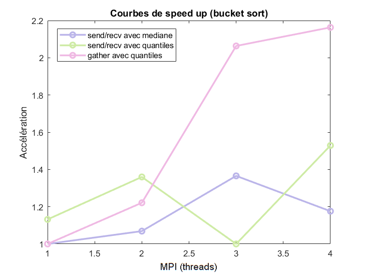

# Compte-rendu TD3
### Elfie Molina--Bonnefoy

##  1 - Données de l'ordinateur sur lequel le TP a été lancé

Les résultats obtenus dans ce TD étant propre à chaque machine, les caractéristiques utiles de l'ordinateur sont données ci-dessous (commande lscpu) :
```
Architecture:             x86_64
  CPU op-mode(s):         32-bit, 64-bit
  Address sizes:          39 bits physical, 48 bits virtual
  Byte Order:             Little Endian
CPU(s):                   8
  On-line CPU(s) list:    0-7
Vendor ID:                GenuineIntel
  Model name:             11th Gen Intel(R) Core(TM) i7-1165G7 @ 2.80GHz
    CPU family:           6
    Model:                140
    Thread(s) per core:   2
    Core(s) per socket:   4
    Socket(s):            1
    
Caches (sum of all):
  L1d:                    192 KiB (4 instances)
  L1i:                    128 KiB (4 instances)
  L2:                     5 MiB (4 instances)
  L3:                     12 MiB (1 instance)
```
Sur cet ordinateur, on peut donc repérer que l'ordinateur possède 4 cœurs physiques et la possibilité d'avoir une parallélisation sur 8 CPU virtuels. 

Cet ordinateur possède aussi une fréquence théorique de calcul de 2.80GHz.

## 2 - Parallélisation du Bucket Sort

Cet exercice cherche à implémenter une parallélisation de l'algorithme bucket sort. Cet algorithme suit les étapes suivantes :
1. Création d'un tableau à trier dans le processus 0 et utilisation de la fonction `scatter` pour partager ce tableau entre les processus
1. Construction des quantiles du tableau local au sein du processus et moyenne globale des quantiles pour avoir un découpage optimal du tableau
1. Création des `nbp` buckets locaux au sein de chaque processus
1. Échange des buckets aux bons processus et trie local
    - Avec les fonctions `send`/`recv` de mpi4py
    - Avec la fonction `gather`
    - Avec la fonction `Alltoall`
1. Concaténation des tableaux par le processeur 0

Dans l'algorithme, il faut être capable de diviser la taille du tableau par $npb^2$. Pour garder une taille commune en fonction des processeurs, on prend une taille de tableau multiple de $144 = 3^2 \times 4^2$. Le code est présent dans le fichier `bucket_sort.py` et a été testé avec une taille de 1440.

Une première version du programme (naïve) a été utilisé avec une approximation des quantiles comme étant la moyenne des valeurs prises en $size/nbp$ et l'utilisation des fonctions `send`/`recv`. Les résultats sont présentés dans le tableau suivant :

MPI (processus) | time (ms)
:--------------:|:--------:
1               | 5.92041015625
2               | 5.5389404296875
3               | 4.3354034423828125
4               | 5.034923553466797

Pour une meilleure approximation, les quantiles ont été calculés avec la fonction `quantile` de la bibliothèque `statistics` dans la suite de l'exercice. Les trois méthodes de partage des données ont été testé.

Ce tableau reprend les temps mis avec l'utilisation des fonctions `send`/`recv` lors de l'envoie des buckets ainsi que le temps mis pour un tri simple :

MPI (processus) | time with MPI (ms) | time simple sort (ms)
:--------------:|:------------------:|:-----------------:
1               | 4.944801330566406  | 0.00858306884765625
2               | 4.381656646728516  | 0.011444091796875
3               | 5.95855712890625   | 0.012636184692382812
4               | 3.8971900939941406 | 0.02288818359375

Ce tableau reprend les temps mis avec l'utilisation de la fonction `gather` lors de l'envoie des buckets ainsi que le temps mis pour un tri simple :
  
MPI (processus) | time with MPI (ms) | time simple sort (ms)
:--------------:|:------------------:|:-----------------:
1               |  2.0294189453125   | 0.0083446502685546
2               | 1.6617774963378906 | 0.0131130218505859
3               | 0.9834766387939453 | 0.0400543212890625
4               | 0.9381771087646484 | 0.0200271606445312




En raison d'un problème sur le caractère non hashable des tableaux np.darray, il a été impossible de faire fonctionner le programme avec la fonction `Alltoall`.