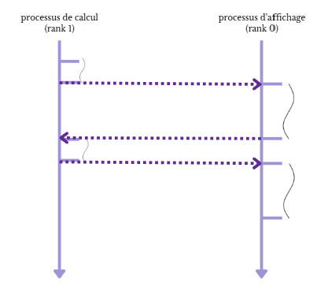
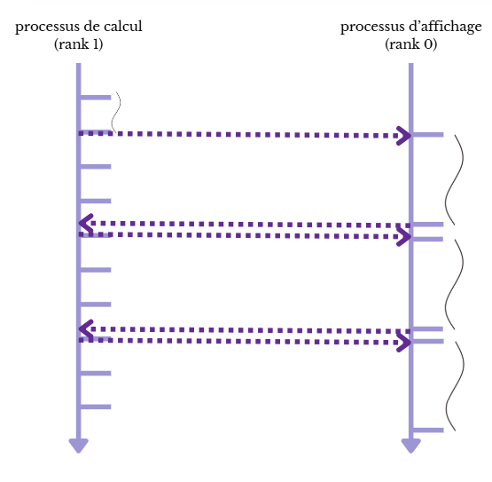

# Compte-rendu TD4
### Elfie Molina--Bonnefoy

##  1 - Données de l'ordinateur sur lequel le TP a été lancé

Les résultats obtenus dans ce TD étant propre à chaque machine, les caractéristiques utiles de l'ordinateur sont données ci-dessous (commande lscpu) :
```
Architecture:             x86_64
  CPU op-mode(s):         32-bit, 64-bit
  Address sizes:          39 bits physical, 48 bits virtual
  Byte Order:             Little Endian
CPU(s):                   8
  On-line CPU(s) list:    0-7
Vendor ID:                GenuineIntel
  Model name:             11th Gen Intel(R) Core(TM) i7-1165G7 @ 2.80GHz
    CPU family:           6
    Model:                140
    Thread(s) per core:   2
    Core(s) per socket:   4
    Socket(s):            1
    
Caches (sum of all):
  L1d:                    192 KiB (4 instances)
  L1i:                    128 KiB (4 instances)
  L2:                     5 MiB (4 instances)
  L3:                     12 MiB (1 instance)
```
Sur cet ordinateur, on peut donc repérer que l'ordinateur possède 4 cœurs physiques et la possibilité d'avoir une parallélisation sur 8 CPU virtuels. 

Cet ordinateur possède aussi une fréquence théorique de calcul de 2.80GHz.

## 2 - Etude du jeu de la vie

Le jeu de la vie est un automate cellulaire se basant sur une grille 2D infinie de cellules qui peuvent prendre deux états : vivante ou morte. Le calcul de ces états suit un algorithme déjà implémenté dans le cadre de cat exercice. L'objectif de ce TD est de paralléliser le calcul et l'affichage de la grille représentant l'automate cellulaire.

Etant donné que le calcul des cellules est en théorie infini, un quota de `n=10000` itérations à été fixé avant de terminer les calculs et ainsi pouvoir comparer les temps des différentes parallélisations pour un cas donné. Pour une meilleure comparaison, plusieurs tailles de fenêtre ont aussi été testées : (200,200), (300,300) et (400,400) sur la même initialisation de départ.

### A - Recherche de la partie lente

Le jeu de la vie est composé de deux étapes principales : le calcul de l'état suivant de la grille et l'affichage de ce nouvel état. L'objectif de cette partie est de savoir laquelle de ces deux étapes est la plus chronophage pour orienter la parallélisation. Pour ce faire, des balises temporelles ont été placées et affichent les temps suivant : 

taille grille | temps calcul moyen (s) | temps affichage moyen (s) | temps global (s)
:------------:|:----------------------:|:-------------------------:|:------------------:
(200,200)     |  0.0004633543622719027 |   0.002100287503140555   | 25.63898229598999
(300,300)     |  0.000557397797207584 |   0.0024656313751330555   | 30.233314752578735
(400,400)     |  0.0009190925609206047 |   0.004344666484546309   | 52.6428542137146

L'étape d'affichage de la grille est donc l'étape la plus chronophage - facteur 10 entre les deux étapes - d'après ces résultats et ceux pour toutes les tailles testées. Les parallélisations suivantes auront donc comme objectif de réduire ce temps-là.

### B - Parallélisation de la partie lente

La **première approche** naïve est de paralléliser le jeu de la vie avec deux processus: l'un s'occupera d'afficher la grille (ici le `rank 0`) et l'autre se chargera de calculer le nouvel état (ici le `rank 1`).



Les temps sont donnés dans le tableau suivant :

taille grille | temps calcul moyen (s) | temps affichage moyen (s) | temps global (s)
:------------:|:----------------------:|:-------------------------:|:------------------:
(200,200)     |  0.002342139562479604  |    0.002342139562479604   | 23.444051027297974
(300,300)     |  0.002783578034103328  |    0.002787211932798419   | 27.880104541778564
(400,400)     |  0.00495888914850733   |    0.004963836149267764   | 49.647289514541626

Si les temps totaux sont légèrement plus faible, il faut remarquer que les temps de calcul ont augmentés de ce facteur 10 pour être équivalent au temps d'affichage. En effet, le processus de calcul (`rank 1`) doit attendre que le processus d'affichage (`rank 0`) soit capable de recevoir une nouvelle donnée et donc ait terminé son affichage.

Cela amène naturellement à une **deuxième parallélisation** plus réfléchie. En tenant compte du fait que l'affichage n'est pas l'objectif final de cet automate (et que le nombre d'images visibles par secondes est de toute manière limité), il est possible de n'afficher que certains états de la grille. Pour ce faire, le processus de calcul (`rank 1`) n'enverra que les états nécessaires et continuera de calculer les prochains états sans s'arrêter.

* **Processus d'affichage** : affichage de la trame reçue et envoie d'un message de fin au processus de calcul
* **Processus de calcul** : calcul en continue de la prochaine itération et envoie de l'état courant lorsqu'il reçoit un message du processus d'affichage



Les temps sont donnés dans le tableau suivant :

taille grille | temps calcul moyen (s) | temps affichage moyen (s) | temps global (s)
:------------:|:----------------------:|:-------------------------:|:------------------:
(200,200)     |  0.0002436062870305987 |   0.0022917571516650253   | 2.49285626411438
(300,300)     | 0.00035671946549699276 |   0.0029387470164330175   | 3.6325924396514893
(400,400)     |  0.0005075707219622276 |   0.004925234271929814    | 5.155322313308716

Le temps total est alors divisé par 10 grâce à cette méthode, avec pour `n=10000` itérations, seulement `1000` affichages environ.

Cette méthode peut encore être améliorée par une **troisième parallélisation** sur plus de processus (`nbp = 3 ou 4`). L'approche consiste à paralléliser le calcul entre deux ou trois processus en découpant la grille torique en deux ou trois morceaux. Le processus d'affichage ne changerait pas de méthode.

* Création d'un sous communicateur ne contenant que les processus de calcul
* Découpage de la grille de manière cartésienne (avec utilisation de cellules fantômes)
* Regroupement des informations sur le processus de calcul commun (ici `rank 1`) 
* Envoie de l'état courant si le processus affichage est libre